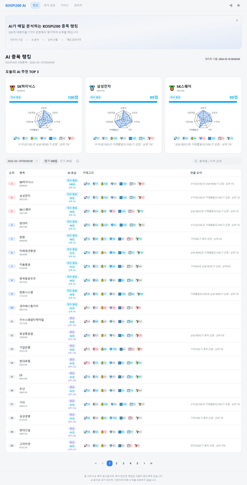
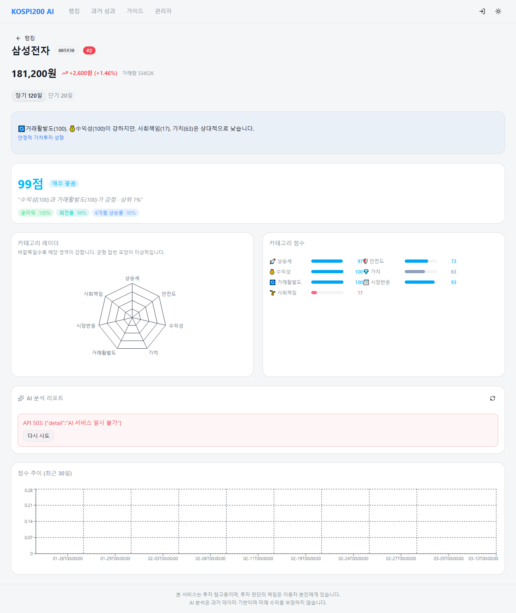
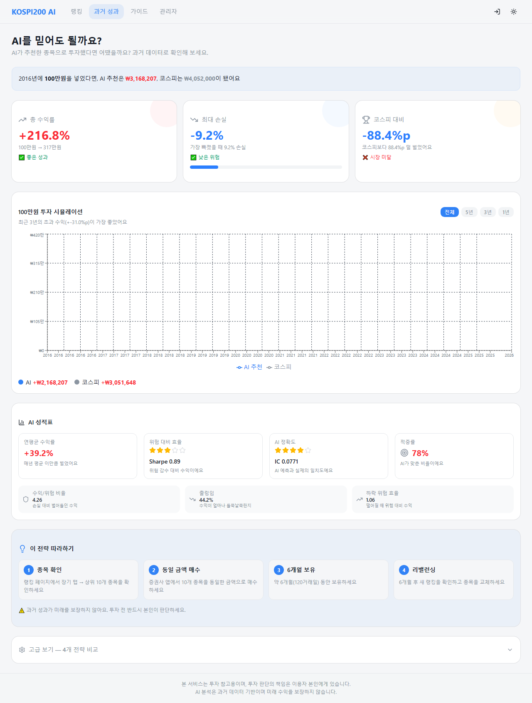
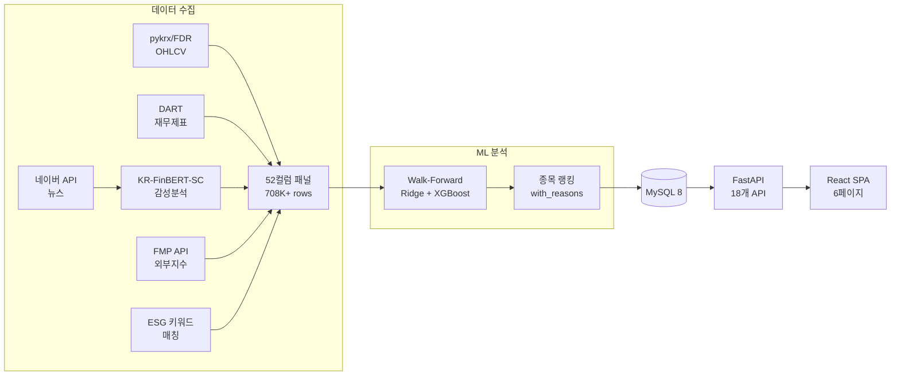

# KOSPI200 AI 랭킹 서비스

> KOSPI200 종목을 7가지 관점으로 매일 평가하는 AI 투자 도우미

<p align="center">
  
</p>

## 핵심 기능

| 기능 | 설명 |
|------|------|
| **AI 종목 랭킹** | 200개 종목 × 7개 카테고리 점수 → 장기(120일)/단기(20일) 전략 |
| **종목 상세 분석** | 레이더 차트 + 카테고리 점수 + AI 리포트 + 현재가 |
| **과거 성과 검증** | "100만원 넣었다면?" 에쿼티 커브 + 드로다운 + 월간 수익률 |
| **투자 가이드** | 초보자 맞춤 3단계 가이드 + 용어사전 + 투자 성향 진단 |
| **시장 현황** | VIX / S&P500 / 시장 국면(강세·약세·보합) 실시간 표시 |
| **관리자 대시보드** | 원버튼 데이터 갱신 + 파이프라인 실시간 로그 |

<details>
<summary>종목 상세 & 백테스트 스크린샷</summary>

| 종목 상세 (삼성전자) | 백테스트 (과거 성과) |
|:---:|:---:|
|  |  |

</details>

## 아키텍처



## 기술 스택

| 영역 | 기술 |
|------|------|
| **프론트엔드** | React 19, TypeScript, Vite 7, Tailwind CSS 4, shadcn/ui, Recharts |
| **백엔드** | FastAPI, SQLAlchemy 2.0, APScheduler, PyJWT, slowapi |
| **데이터** | pandas, pykrx, FinanceDataReader, OpenDartReader |
| **ML** | Ridge, XGBoost, RandomForest, scikit-learn (Walk-Forward CV) |
| **NLP** | KR-FinBERT-SC (한국어 금융 감성분석, HuggingFace) |
| **DB** | MySQL 8 (Docker), 15개 테이블 |
| **외부 API** | 네이버 검색, DART, FMP, Gemini/Groq |

## Quick Start

```bash
# 1. 클론 + 의존성
git clone https://github.com/humpie-0413/kospi200.git
cd kospi200
pip install -r requirements.txt

# 2. 환경변수
cp .env.example src/backend/.env
# src/backend/.env 열어서 DB_PASSWORD 등 입력

# 3. Docker MySQL
docker-compose up -d

# 4. 데이터 다운로드 (Google Drive → 자동)
python scripts/setup_data.py

# 5. MySQL 적재 (15개 테이블)
python scripts/init_mysql.py

# 6. 프론트엔드 빌드
cd src/frontend && npm install && npm run build && cd ../..

# 7. 서버 실행
cd src/backend && uvicorn app.main:app --port 8000

# 8. http://localhost:8000 접속
```

### 사전 요구사항

- Python 3.11+
- Node.js 18+
- Docker (MySQL용)

## API 키 발급 가이드

| API | 용도 | 무료 한도 | 발급 방법 |
|-----|------|-----------|-----------|
| **DART** | 재무제표 | 10,000건/일 | [opendart.fss.or.kr](https://opendart.fss.or.kr) 회원가입 → 인증키 발급 |
| **네이버 검색** | 뉴스 수집 | 25,000건/일 | [developers.naver.com](https://developers.naver.com) → 애플리케이션 등록 → Client ID/Secret |
| **Gemini** | AI 분석 리포트 | 15 RPM | [aistudio.google.com](https://aistudio.google.com) → API Key 생성 |
| **Groq** | AI 분석 리포트 (대체) | 30 RPM | [console.groq.com](https://console.groq.com) → API Key |
| **FMP** | S&P500, VIX 등 외부지수 | 250건/일 | [financialmodelingprep.com](https://financialmodelingprep.com) → Free plan 가입 |

> DART + 네이버만 있으면 핵심 기능 동작. Gemini/Groq/FMP는 선택.

## 프로젝트 구조

```
kospi200/
├── src/
│   ├── backend/                    # FastAPI 백엔드
│   │   ├── app/
│   │   │   ├── main.py             # 앱 진입점 + SPA 서빙
│   │   │   ├── config.py           # 환경변수 설정
│   │   │   ├── models/             # ORM 모델 (15개 테이블)
│   │   │   ├── routers/            # API 라우터 (18개 엔드포인트)
│   │   │   └── services/           # 비즈니스 로직 + 스케줄러
│   │   └── seed_admin.py           # 관리자 계정 생성
│   └── frontend/                   # React SPA
│       └── src/
│           ├── pages/              # 6개 페이지
│           ├── components/         # shadcn/ui 컴포넌트
│           └── types/ranking.ts    # 핵심 타입 + 한글 매핑
├── scripts/
│   ├── daily_news_pipeline.py      # 11단계 일일 파이프라인
│   ├── setup_data.py               # Google Drive 데이터 다운로드
│   ├── init_mysql.py               # MySQL 초기 데이터 로드
│   └── daily_update.py             # 일일 갱신 스크립트
├── configs/                        # ESG 키워드 등 설정
├── docs/                           # 설계 문서 + 스크린샷
├── docker-compose.yml              # MySQL + API 컨테이너
├── requirements.txt                # Python 전체 의존성
└── .env.example                    # 환경변수 템플릿
```

## 데이터 파이프라인

매일 06:00 KST 자동 실행 (11단계, ~25분):

```
Step 0a  유니버스 멤버십 확장 (월별 KOSPI200 구성 종목)
Step 0b  OHLCV 수집 (FinanceDataReader, 200종목)
Step 0c  기술적 피처 재계산 (모멘텀, 변동성, RSI, 볼린저)
Step 0d  패널 재구축 (OHLCV + 재무 + 유니버스 → 52컬럼)
Step 0e  외부 지수 수집 (S&P500, VIX, WTI, US10Y, DXY)
Step 1   뉴스 수집 (네이버 검색 API)
Step 2   감성분석 (KR-FinBERT-SC, GPU 가속)
Step 3   news_sentiment_daily 갱신 (EWM 5/20일)
Step 4   ESG 키워드 매칭 → esg_daily 갱신
Step 5   패널 머지 + Walk-Forward 랭킹 생성 + with_reasons
Step 6   MySQL 리로드 + 당일 날짜 복제
```

### 52컬럼 패널 구성

| 카테고리 | 컬럼 수 | 예시 | 소스 |
|----------|---------|------|------|
| OHLCV + 기술적 | 16 | close, RSI_14, momentum_6m, volatility_60d | pykrx/FDR |
| 뉴스 감성 | 6 | news_sentiment, news_sentiment_ewm20 | KR-FinBERT-SC |
| ESG | 4 | esg_score, environmental_score | ESG 키워드 매칭 |
| 재무 | 5 | roe, debt_ratio, net_income | DART API |
| 외부 지수 | 7 | vix_level, sp500_ret_1d, market_regime | FMP API |
| 카테고리 점수 | 7 | cat_momentum, cat_risk, cat_esg | Z-score 백분위 |

> 전체 52컬럼 상세: [docs/DATA_DICTIONARY.md](docs/DATA_DICTIONARY.md)

## ML 모델

### Walk-Forward 검증

- **방법**: Rolling 5년 학습 → 20일 테스트, 20일 간격 이동
- **모델**: Ridge (주력) + XGBoost + RandomForest 앙상블
- **Time Decay**: 최신 데이터 가중 (lambda=3.0)
- **비용**: 편도 12bps 반영

### 성과 (Holdout 2023~)

| 전략 | CAGR | Sharpe | Hit Ratio | MDD |
|------|------|--------|-----------|-----|
| **장기 120일** (bt120_long) | 12.38% | 0.671 | 53.3% | -51.0% |
| **단기 20일** (bt20_short) | 5.23% | 0.338 | 51.0% | -50.8% |

### 피처 중요도 Top 10 (장기 전략)

| 순위 | 피처 | 가중치 | 카테고리 |
|------|------|--------|----------|
| 1 | debt_ratio | 0.096 | 가치 |
| 2 | total_liabilities | 0.095 | 가치 |
| 3 | net_income | 0.088 | 수익성 |
| 4 | roe | 0.085 | 수익성 |
| 5 | turnover | 0.079 | 유동성 |
| 6 | volatility_60d | 0.069 | 리스크 |
| 7 | momentum_6m | 0.066 | 모멘텀 |
| 8 | max_drawdown_60d | 0.063 | 리스크 |
| 9 | downside_volatility_60d | 0.054 | 리스크 |
| 10 | price_momentum_60d | 0.048 | 모멘텀 |

## API 엔드포인트 (18개)

| 카테고리 | 엔드포인트 | 설명 |
|----------|-----------|------|
| 랭킹 | `GET /api/rankings` | 종목 랭킹 (장기/단기, 페이지네이션) |
| 랭킹 | `GET /api/rankings/{ticker}` | 종목 상세 (카테고리 점수 + 기여 피처) |
| 랭킹 | `GET /api/rankings/{ticker}/price` | 현재가 + 등락률 |
| 랭킹 | `GET /api/rankings/freshness` | 데이터 신선도 |
| 백테스트 | `GET /api/backtest/metrics` | 전략별 성과 지표 |
| 백테스트 | `GET /api/backtest/equity-curve` | 에쿼티 커브 데이터 |
| 시장 | `GET /api/market/status` | VIX/S&P500/시장 국면 |
| AI | `GET /api/ai/analysis/{ticker}` | Gemini/Groq AI 분석 리포트 |
| 인증 | `POST /api/auth/login` | JWT 로그인 |
| 관리자 | `POST /api/admin/pipeline/daily` | 파이프라인 실행 |

## 일일 갱신

```bash
python scripts/daily_update.py              # 전체 파이프라인 (~25분)
python scripts/daily_update.py --ohlcv-only  # OHLCV만 갱신 (~3분)
python scripts/daily_update.py --date 2026-03-20  # 특정 날짜
```

서버 내장 스케줄러로 매일 06:00 KST 자동 실행 (`SCHEDULER_ENABLED=true`).

## 향후 계획

- [ ] 서버 배포 (VPS + Docker Compose + nginx + SSL)
- [ ] L5 모델 재학습 (Time Decay + 앙상블 최적화)
- [ ] 커스텀 랭킹 (사용자 피처 선택 → 개인화 순위)
- [ ] 유사 종목 추천 / 업종 필터 / 관심 종목
- [ ] CI/CD + 테스트 코드
- [ ] 구독 수익화 (애드센스 or 유료)

## 개발 이력

| 세션 | 내용 |
|------|------|
| A1~A2 | MVP: 데이터 자동화 + GitHub 배포 |
| B1~B2 | 기술적 지표(RSI, 볼린저) + XGBoost 최적화 |
| C1~C2 | 외부 지수 7개 + Walk-Forward 119/114 folds 검증 |
| D1 | L5 앙상블 버그 수정 + Time Decay + 프로덕션 보안 |
| UI-FIX-1~2 | 한글화 + 카드 재디자인 + TOP3 + AI 리포트 |
| BEGINNER-1~2 | 초보자 친화 UX 전면 개선 (P0+P1 22항목) |
| BACKTEST-REDESIGN | 백테스트 페이지 전면 재설계 (9작업) |
| WRAP-UP | 프로젝트 정리 + README + 핸드오프 최종화 |

## 면책

본 프로젝트는 학습/연구 목적이며, 투자 판단의 책임은 이용자 본인에게 있습니다.
AI 분석은 과거 데이터 기반이며 미래 수익을 보장하지 않습니다.

## 라이선스

MIT License
