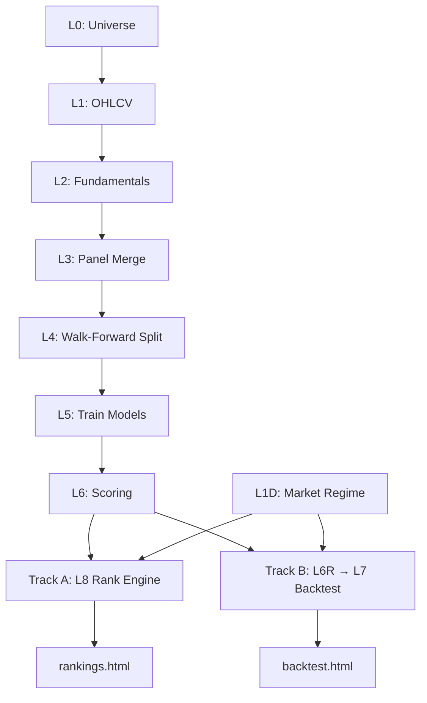

# 프로젝트 분석 보고서

## 1. 프로젝트 개요

| 항목 | 내용 |
|------|------|
| 프로젝트명 | KOSPI200 종목 랭킹 & 백테스트 시스템 |
| 목적 | KOSPI200 구성종목 대상 팩터 기반 랭킹 + 포트폴리오 백테스트 수행, 결과를 웹 대시보드로 시각화 |
| 주요 기능 | (1) 종목 팩터 랭킹 (LONG/SHORT TOP20) (2) Walk-forward 백테스트 (3) 시장 국면 기반 동적 조정 |
| 기술스택 | Python 3.13+, pandas, scikit-learn, xgboost, MySQL 8.0, Bootstrap5+Chart.js |

> [확인] Y

---

## 2. 현재 아키텍처

- **Multi-Track Pipeline**: Track A(랭킹) / Track B(백테스트) 분리, Shared 데이터 계층(L0~L4)
- **진입점**: CLI (`cli.py`) → config.yaml 로드 → Stage 순차 실행
- **출력**: 정적 HTML 대시보드 (서버 없는 클라이언트 JS 렌더링)

> [확인] Y

---

## 3. 완성된 부분

| 영역 | 완성도 | 핵심 내용 |
|------|--------|----------|
| 데이터 파이프라인 (L0~L4) | 90% | pykrx 수집, merge_asof 병합, walk-forward CV split |
| 모델링 (L5~L6) | 85% | Ridge/RF/XGB walk-forward 훈련, OOS 예측 통합 |
| 랭킹 엔진 (L8) | 80% | Cross-sectional 정규화, 팩터 가중합, 순위 부여 |
| 백테스트 (L7) | 75% | 월별 리밸런싱, 비용/슬리피지, 적응형 리밸런싱 |
| 시장 국면 | 75% | bull/neutral/bear 3단계 분류, 국면별 가중치 |
| 테스트 | 55% | 40+ 케이스, fixture 기반, 일부 skip 처리 |
| UI 대시보드 | 50% | 정적 HTML 2페이지, JSON 데이터 기반 |
| DB (MySQL) | 60% | 43개 테이블 DDL, 하드코딩 경로 |

> [확인] Y

---

## 4. 미완성 / 수정 필요

| # | 영역 | 현황 | 제안 |
|---|------|------|------|
| 1 | 웹 서비스 | 정적 HTML만 존재, API 없음 | FastAPI/Flask 기반 REST API + SPA 프론트엔드 구축 |
| 2 | Stage 의존성 | pipeline.py에 의존성 그래프 없음 | DAG 기반 실행 또는 명시적 의존성 선언 |
| 3 | 이식성 | SQL/config에 절대경로 하드코딩 | 환경변수 + 상대경로로 전환 |
| 4 | 래퍼 이중구조 | stages/data → tracks/shared 위임 | 단일 위치로 통합 |
| 5 | overlapping_tranches | l7_backtest에 미완성 기능 | 구현 완료 또는 제거 |

> [확인] Y - 1~5 모두 승인

---

## 5. 제안 방향성

| 계층 | 제안 |
|------|------|
| 백엔드 | FastAPI로 REST API 구축. 기존 파이프라인 로직 재활용, 랭킹/백테스트 결과 조회 API |
| 프론트엔드 | React 또는 Vue SPA. 기존 Chart.js 차트를 컴포넌트화, 실시간 필터/구간 선택 |
| DB | MySQL 유지 또는 SQLite로 경량화. ORM(SQLAlchemy) 도입으로 이식성 확보 |
| 배포 | Docker Compose (API + DB + 프론트). 환경변수로 설정 주입 |

> [확인] Y

---

## 6. 추가 질문

1. **웹 서비스 범위**: 일반 이용자는 조회만. 관리자(본인)는 데이터 수집 + 다음날짜 예측 랭킹 생성 실행 트리거 필요.
2. **사용자 대상**: 외부 공개. 인증 필요 (관리자/일반 사용자 권한 분리).
3. **데이터 갱신 주기**: 매일 새벽 06:00 배치 갱신. 당일 랭킹 예측 생성 필요.

### 반영 사항
- **2-Tier 권한**: 관리자(파이프라인 트리거) / 일반 사용자(조회 전용)
- **스케줄링**: 매일 06:00 cron/스케줄러로 데이터 수집 → 모델 예측 → 랭킹 생성 자동화
- **관리자 API**: 데이터 수집 트리거, 랭킹 생성 트리거, 실행 상태 모니터링
